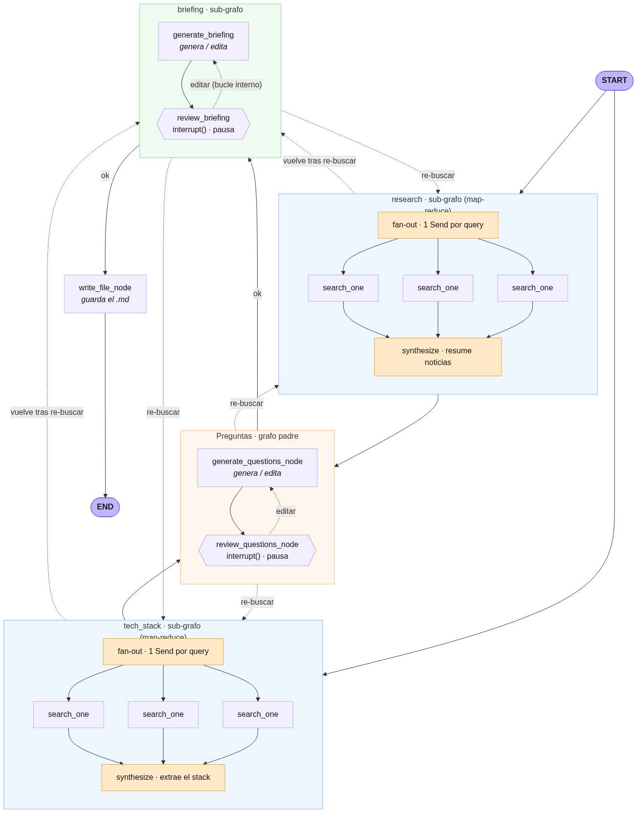

# Interview Research Agent 🕵️

Agente construido con **LangGraph** que investiga una empresa antes de una
entrevista y genera un **briefing en Markdown**. Incluye *human-in-the-loop*:
el agente se pausa para que una persona revise las preguntas y el briefing, y
puede pedir retoques de redacción o que vuelva a **buscar datos nuevos** en la web.

Usa **Azure OpenAI (Azure AI Foundry)** como modelo y **Tavily** para la búsqueda web.

---

## ¿Qué hace?

A partir del nombre de una empresa:

1. **Investiga en paralelo** qué hace la empresa + sus noticias recientes
   (`research_node`) y su **stack tecnológico** real (`tech_stack_node`).
2. **Genera 3 preguntas** concretas para la entrevista (nada de frases genéricas)
   y se **pausa** para que las revises.
3. **Monta el briefing final** en Markdown y se **pausa** otra vez para tu visto bueno.
4. Al aprobar, **guarda el `.md`** en la carpeta `briefings/`.

En cada pausa puedes:

- escribir `ok` para aprobar,
- pedir un **retoque de redacción** (p.ej. *"cambia la pregunta 2 por una de IA"*) —
  solo cambia eso, el resto se mantiene igual,
- pedir **datos nuevos** (p.ej. *"vuelve a buscar sus frameworks"*) — el agente
  **busca de verdad** otra vez y reconstruye con la info actualizada.

---

## Arquitectura del grafo



Dos ideas clave del diseño:

1. **Generar y revisar están en nodos separados.** En LangGraph, al reanudar
   tras una pausa (`interrupt()`) el nodo se re-ejecuta desde el principio; si el
   LLM estuviera antes de la pausa, regeneraría todo en cada reanudación. Por eso
   un nodo **genera** (llama al LLM) y otro **revisa** (solo pausa y lee el estado).
2. **Enrutado por intención del feedback.** Un clasificador decide si tu petición
   es `edit` (reescribir, barato), `research` o `tech_stack` (volver a buscar).

> El diagrama se regenera con `python show_graph.py`. Está dibujado a mano en
> `show_graph.py` para que se lea bien; si cambias el grafo, actualiza también ese archivo.

---

## Requisitos

- Python 3.10+
- Un recurso de **Azure OpenAI / Foundry** con un *deployment* de un modelo de chat (p.ej. gpt-4o)
- Una **API key de Tavily** (https://tavily.com)

---

## Instalación

```powershell
# 1. Clonar el repo
git clone https://github.com/JorgePulgar/langgraph-test.git
cd langgraph-test

# 2. Crear y activar un entorno virtual
python -m venv .venv
.\.venv\Scripts\Activate.ps1        # Windows PowerShell
# source .venv/bin/activate          # macOS / Linux

# 3. Instalar dependencias
pip install -r requirements.txt
```

---

## Configuración (variables de entorno)

Copia la plantilla y rellena tus claves reales:

```powershell
copy .env.example .env               # Windows
# cp .env.example .env                # macOS / Linux
```

Edita `.env`:

```dotenv
# --- Azure OpenAI (Azure AI Foundry) ---
AZURE_OPENAI_ENDPOINT=https://<tu-recurso>.openai.azure.com/   # o .services.ai.azure.com
AZURE_OPENAI_API_KEY=...
OPENAI_API_VERSION=2024-10-21        # versión de la API, NO la del modelo
AZURE_OPENAI_DEPLOYMENT=gpt-4o       # el NOMBRE DEL DEPLOYMENT, no del modelo

# --- Tavily (búsqueda web) ---
TAVILY_API_KEY=tvly-...
```

> ⚠️ Dos errores típicos:
> - `OPENAI_API_VERSION` es la versión de la **API** (`2024-10-21`), no la del
>   modelo (`2024-11-20`). Usa la que muestre tu *deployment*.
> - `AZURE_OPENAI_DEPLOYMENT` es el **nombre que le diste al deployment** en
>   Foundry, que puede no coincidir con el nombre del modelo.
>
> El archivo `.env` está en `.gitignore`: **nunca subas tus claves al repo.**

---

## Uso

```powershell
python interview_agent.py "Stripe"
```

Si no pasas nombre, usa `Stripe` por defecto. El agente se pausará por consola;
responde `ok` o escribe qué cambiar. Al terminar verás la ruta del `.md` generado
en `briefings/`.

---

## Visualizar el grafo

```powershell
python show_graph.py
```

Genera `graph.png` (ábrelo en VSCode) y `graph.mmd` (texto Mermaid, previsualizable
con la extensión *Markdown Preview Mermaid Support*).

---

## Estructura del proyecto

```
.
├── interview_agent.py   # el agente (grafo, nodos, ejecución) — comentado en español
├── show_graph.py        # genera el diagrama del grafo (graph.png / graph.mmd)
├── requirements.txt     # dependencias
├── .env.example         # plantilla de variables de entorno
├── graph.png            # diagrama del grafo
└── briefings/           # salida: los .md generados (ignorada por git)
```

---

## Notas

- El **clasificador de feedback** usa el LLM, así que es fiable pero no perfecto.
  Si una petición ambigua se interpreta mal, reformúlala (p.ej. *"vuelve a buscar..."*).
- `MemorySaver` guarda el estado **en memoria**: se pierde al cerrar el programa.
  Para algo persistente se usaría un checkpointer con base de datos.
