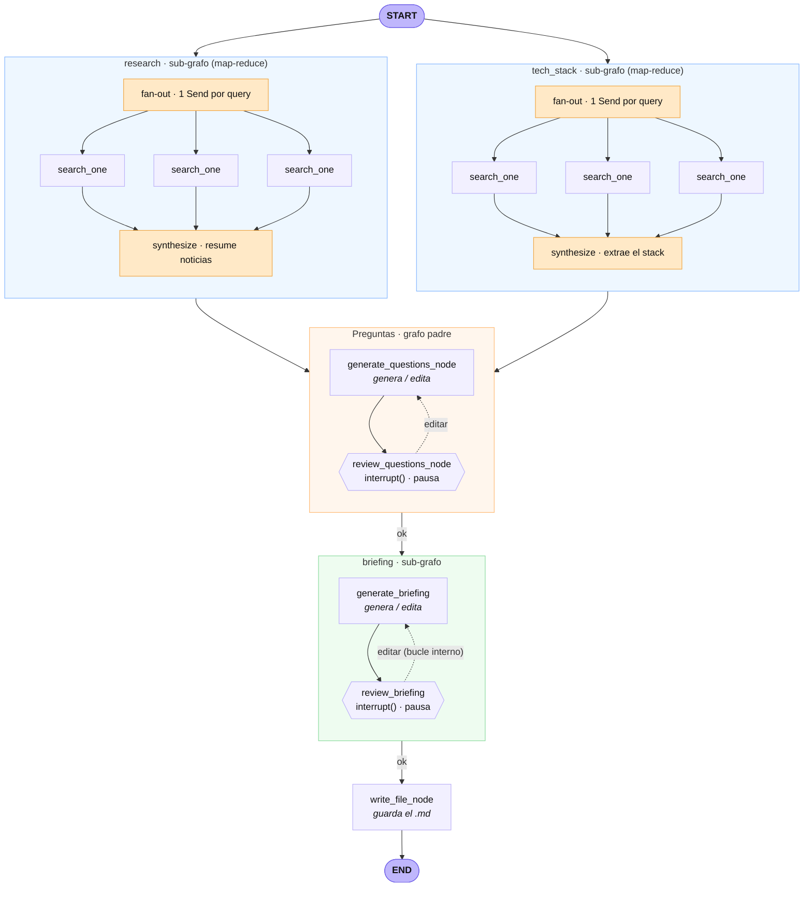
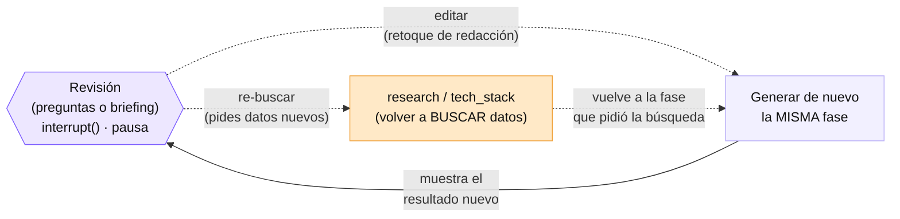

# Interview Research Agent 🕵️

Agente construido con **LangGraph** que investiga una empresa antes de una
entrevista y genera un **briefing en Markdown**. Incluye *human-in-the-loop*:
el agente se pausa para que una persona revise las preguntas y el briefing, y
puede pedir retoques de redacción o que vuelva a **buscar datos nuevos** en la web.

Usa **Azure OpenAI (Azure AI Foundry)** como modelo y **Tavily** para la búsqueda web.

---

## ¿Qué hace?

A partir del nombre de una empresa:

1. **Investiga en paralelo** qué hace la empresa + sus noticias recientes
   (sub-grafo `research`) y su **stack tecnológico** real (sub-grafo `tech_stack`).
2. **Genera 3 preguntas** concretas para la entrevista (nada de frases genéricas)
   y se **pausa** para que las revises.
3. **Monta el briefing final** en Markdown y se **pausa** otra vez para tu visto bueno.
4. Al aprobar, **guarda el `.md`** en la carpeta `briefings/`.

En cada pausa puedes:

- escribir `ok` para aprobar,
- pedir un **retoque de redacción** (p.ej. *"cambia la pregunta 2 por una de IA"*) —
  solo cambia eso, el resto se mantiene igual,
- pedir **datos nuevos** (p.ej. *"vuelve a buscar sus frameworks"*) — el agente
  **busca de verdad** otra vez y reconstruye con la info actualizada.

---

## Arquitectura del grafo



El diagrama de arriba muestra el **camino principal** (la espina vertical) y, dentro
de cada caja, sus detalles: el map-reduce de búsqueda y el bucle interno de
**edición** (`editar`).

Aparte, los **bucles de feedback** que ocurren cuando NO respondes `ok` en una
revisión van en este segundo diagrama (se separan porque, dibujados sobre la espina
vertical, descuadran el layout):



> GitHub renderiza los bloques `mermaid` de forma interactiva. También se generan
> `graph.png` (camino principal) y `graph-loops.png` (bucles de feedback) con
> `python show_graph.py`, por si los prefieres como imagen.

**¿Y todo en UN solo diagrama?** Los bucles de re-búsqueda apuntan *hacia arriba*
(de una revisión de vuelta a `research`/`tech_stack`), o sea forman ciclos. Los
motores de auto-layout de Mermaid (dagre/ELK) no pueden dibujar un ciclo como un
árbol limpio de arriba-abajo: o descuadran las cajas, o bajan `START` del tope. Por
eso arriba se separan en dos diagramas. Si quieres **todo junto con START arriba y
las flechas de vuelta**, hay un diagrama hecho a mano (coordenadas fijas) en
[`graph.drawio`](graph.drawio): ábrelo con [draw.io](https://app.diagrams.net),
la app de escritorio o la extensión *Draw.io Integration* de VSCode. Es editable
pero **no se autogenera** desde el código (hay que mantenerlo a mano).

### Cómo funciona por dentro (resumen sencillo)

Hay un **grafo padre** (el agente principal). Dentro de él, tres de sus "nodos"
no son funciones sueltas: son **grafos más pequeños** (sub-grafos) que hacen el
trabajo de esa fase:

- `research` y `tech_stack` son sub-grafos que **corren a la vez** (en paralelo
  entre ellos). Y, además, **cada uno lanza sus 3 búsquedas web a la vez** por
  dentro. Es decir: hay paralelismo en dos niveles.
- `briefing` también es un sub-grafo, pero **corre más tarde y él solo**, sin
  paralelismo: solo redacta el briefing y espera tu aprobación.

En una frase: *`research` y `tech_stack` investigan en paralelo (y cada uno
dispara sus búsquedas en paralelo); cuando apruebas las preguntas, el sub-grafo
`briefing` redacta el documento por su cuenta y se pausa para tu visto bueno.*

### Cómo funciona por dentro (versión técnica)

Cuatro ideas clave del diseño:

1. **Generar y revisar están en nodos separados.** En LangGraph, al reanudar
   tras una pausa (`interrupt()`) el nodo se re-ejecuta desde el principio; si el
   LLM estuviera antes de la pausa, regeneraría todo en cada reanudación. Por eso
   un nodo **genera** (llama al LLM) y otro **revisa** (solo pausa y lee el estado).
2. **Enrutado por intención del feedback.** Un clasificador (LLM) decide si tu
   petición es `edit` (reescribir, barato), `research` o `tech_stack` (volver a buscar).
3. **Sub-grafos.** `research`, `tech_stack` y `briefing` son grafos compilados que
   se usan como un nodo dentro del padre. Encapsulan una fase entera y se comunican
   con el padre **por nombre de clave del estado** (las claves que existen en ambos
   cruzan; las internas, como `search_results`, no se ven desde fuera). Se compilan
   **sin checkpointer**: heredan el del padre, por eso el `interrupt()` que vive
   dentro del sub-grafo `briefing` burbujea hasta el `invoke()` de arriba igual que
   el de las preguntas.
4. **Map-reduce con `Send` (búsqueda en paralelo).** Cada sub-grafo de búsqueda no
   lanza sus queries en fila, sino con el patrón map-reduce:
   - **MAP** — una función de *fan-out* devuelve una lista de `Send(...)`, uno por
     query; LangGraph crea N copias del trabajador `search_one` y las ejecuta a la vez.
   - **REDUCE** — todos los trabajadores escriben en `search_results`, un canal con
     reducer `Annotated[list[str], operator.add]` que **concatena** en vez de pisar.
     Al terminar todos (*fan-in*), un único nodo `synthesize` resume con el LLM.
   - Cada sub-grafo declara un `output_schema` (solo su clave de resultado) para que,
     al correr `research` y `tech_stack` en el mismo paso, no choquen escribiendo
     claves compartidas (`company`, …) y LangGraph no lance `InvalidUpdateError`.

**Dos niveles de paralelismo:** (A) `research` ‖ `tech_stack` como hermanos desde
`START`; (B) dentro de cada uno, sus 3 `search_one` a la vez. `briefing` no tiene
paralelismo interno (es `generate → review` + bucle de edición).

> El diagrama se regenera con `python show_graph.py`. Está dibujado a mano en
> `show_graph.py` para que se lea bien; si cambias el grafo, actualiza también ese archivo.

### Comprobar que los sub-grafos y el map-reduce corren de verdad

Un run normal produce la misma salida que una versión secuencial, así que "salió un
briefing" no prueba nada. `inspect_run.py` ejecuta el grafo con `stream(..., subgraphs=True)`
e imprime cada nodo con su *namespace*:

```powershell
python inspect_run.py "Vercel"
```

Qué buscar en la salida:

- `search_one` **×3** bajo `('research:...')` y **×3** bajo `('tech_stack:...')` →
  el fan-out con `Send` ocurrió (6 trabajadores). Si además sus eventos aparecen
  **intercalados** entre los dos namespaces, es prueba de que corrieron en paralelo.
- `synthesize` **×1** por cada namespace → el *fan-in* del reduce.
- *Namespaces* **no vacíos** (`('briefing:...')`, etc.) frente a `ns=()` de los nodos
  del padre → los sub-grafos corrieron de verdad.

---

## Requisitos

- Python 3.10+
- Un recurso de **Azure OpenAI / Foundry** con un *deployment* de un modelo de chat (p.ej. gpt-4o)
- Una **API key de Tavily** (https://tavily.com)

---

## Instalación

```powershell
# 1. Clonar el repo
git clone https://github.com/JorgePulgar/langgraph-test.git
cd langgraph-test

# 2. Crear y activar un entorno virtual
python -m venv .venv
.\.venv\Scripts\Activate.ps1        # Windows PowerShell
# source .venv/bin/activate          # macOS / Linux

# 3. Instalar dependencias
pip install -r requirements.txt
```

---

## Configuración (variables de entorno)

Copia la plantilla y rellena tus claves reales:

```powershell
copy .env.example .env               # Windows
# cp .env.example .env                # macOS / Linux
```

Edita `.env`:

```dotenv
# --- Azure OpenAI (Azure AI Foundry) ---
AZURE_OPENAI_ENDPOINT=https://<tu-recurso>.openai.azure.com/   # o .services.ai.azure.com
AZURE_OPENAI_API_KEY=...
OPENAI_API_VERSION=2024-10-21        # versión de la API, NO la del modelo
AZURE_OPENAI_DEPLOYMENT=gpt-4o       # el NOMBRE DEL DEPLOYMENT, no del modelo

# --- Tavily (búsqueda web) ---
TAVILY_API_KEY=tvly-...
```

> ⚠️ Dos errores típicos:
> - `OPENAI_API_VERSION` es la versión de la **API** (`2024-10-21`), no la del
>   modelo (`2024-11-20`). Usa la que muestre tu *deployment*.
> - `AZURE_OPENAI_DEPLOYMENT` es el **nombre que le diste al deployment** en
>   Foundry, que puede no coincidir con el nombre del modelo.
>
> El archivo `.env` está en `.gitignore`: **nunca subas tus claves al repo.**

---

## Uso

```powershell
python interview_agent.py "Stripe"
```

Si no pasas nombre, usa `Stripe` por defecto. El agente se pausará por consola;
responde `ok` o escribe qué cambiar. Al terminar verás la ruta del `.md` generado
en `briefings/`.

---

## Visualizar el grafo

```powershell
python show_graph.py
```

Genera `graph.png` (ábrelo en VSCode) y `graph.mmd` (texto Mermaid, previsualizable
con la extensión *Markdown Preview Mermaid Support*).

---

## Estructura del proyecto

```
.
├── interview_agent.py   # el agente (grafo padre + sub-grafos + map-reduce) — comentado en español
├── show_graph.py        # genera el diagrama del grafo (graph.png / graph.mmd)
├── inspect_run.py       # ejecuta con stream(subgraphs=True) para ver sub-grafos y map-reduce
├── requirements.txt     # dependencias
├── .env.example         # plantilla de variables de entorno
├── graph.png            # diagrama: camino principal (espina vertical)
├── graph-loops.png      # diagrama: bucles de feedback (editar / re-buscar)
├── graph.drawio         # diagrama hecho a mano: todo en uno (editable en draw.io)
└── briefings/           # salida: los .md generados (ignorada por git)
```

---

## Notas

- El **clasificador de feedback** usa el LLM, así que es fiable pero no perfecto.
  Si una petición ambigua se interpreta mal, reformúlala (p.ej. *"vuelve a buscar..."*).
- `MemorySaver` guarda el estado **en memoria**: se pierde al cerrar el programa.
  Para algo persistente se usaría un checkpointer con base de datos.
